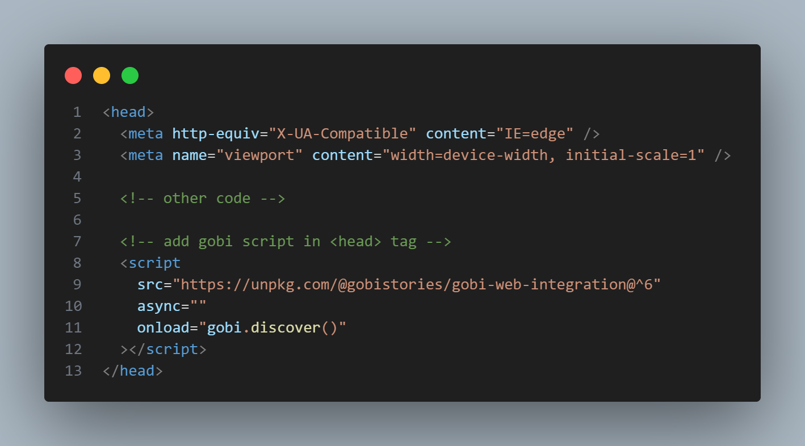

# Fix misaligned bubbles

### To fix the bubbles are misaligned, copy gobi script from one of the bubble elements and place it within the `<head> ... </head>` tags of your HTML document.

> This single placement eliminates the need to insert the script separately into each bubble element. This streamlined approach enables the use of the Gobi story script across multiple bubbles without redundancy.

## 1. Copy the Gobi script from one of the bubble elements.

## 2. Paste the copied Gobi script inside the `<head> ... </head>` tags of your HTML document.

## 3. Remove all script tags inside Gobi story bubble elements.

|          Before           |          After           |
| :-----------------------: | :----------------------: |
|  |  |

## Result

